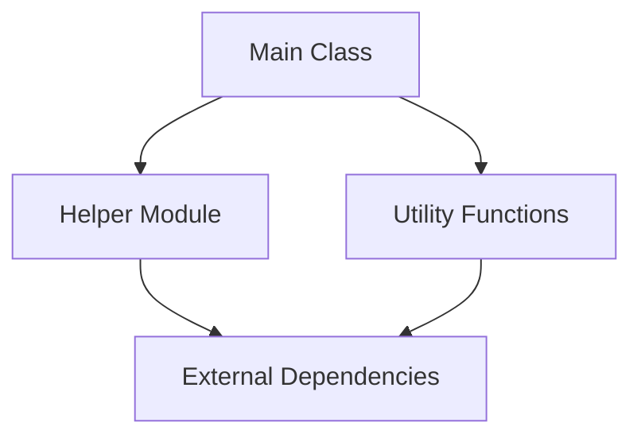

# Подробное описание Structured Ultimate Analyzer v2.0

## 📋 Обзор

Structured Ultimate Analyzer - это продвинутый инструмент статического анализа кода, разработанный как часть системы IntelliRefactor. Он обеспечивает глубокий анализ Python-проектов с генерацией комплексной документации и выявлением возможностей для рефакторинга.

**Версия:** 2.0.0  
**Дата обновления:** 2026-01-09  
**Статус:** Production Ready

---

## 🎯 Основные функции

### 1. Глубокий статический анализ
- **AST-анализ** исходного кода
- **Извлечение метрик** сложности, размера, связности
- **Обнаружение паттернов** кода и архитектурных решений
- **Анализ зависимостей** между модулями

### 2. Интеллектуальная генерация документации
- **Автоматическое создание Requirements.md**
- **Генерация архитектурных диаграмм** (Mermaid)
- **Flowchart'ы** и диаграммы потоков
- **Call graph'ы** вызовов функций
- **Отчеты о рефакторинге**

### 3. Обнаружение возможностей рефакторинга
- **Выявление God Object'ов**
- **Обнаружение дублирующегося кода**
- **Поиск неиспользуемых компонентов**
- **Анализ архитектурных запахов**

### 4. Безопасная система рефакторинга
- **Dry-run режим** для проверки изменений
- **Автоматическое создание резервных копий**
- **Система отката** изменений
- **Валидация результатов**

---

## 🏗️ Архитектура системы

### Основные компоненты:

#### 1. **FileAnalyzer**
**Назначение:** Анализ отдельных файлов
```python
class FileAnalyzer:
    def analyze_file(self, file_path: str) -> AnalysisResult:
        # Извлечение метрик
        # Анализ AST
        # Обнаружение паттернов
        pass
```

#### 2. **ContextCollector**
**Назначение:** Сбор контекста проекта
```python
class ContextCollector:
    def collect_context(self, project_path: str) -> ProjectContext:
        # Сбор информации о проекте
        # Анализ зависимостей
        # Извлечение конфигураций
        pass
```

#### 3. **DocumentationGenerator**
**Назначение:** Генерация документации
```python
class DocumentationGenerator:
    def generate_requirements(self, analysis_result: AnalysisResult) -> str:
        # Генерация Requirements.md
        # Использование шаблонов
        # Fallback на основе данных анализа
        pass
```

#### 4. **RefactoringPlanner**
**Назначение:** Планирование рефакторинга
```python
class RefactoringPlanner:
    def plan_refactoring(self, analysis_result: AnalysisResult) -> RefactoringPlan:
        # Выявление God Object'ов
        # Планирование разделения
        # Оценка сложности
        pass
```

---

## 🔧 Алгоритмы анализа

### 1. Анализ сложности (Complexity Analysis)
```python
def calculate_complexity(ast_node) -> dict:
    """
    Вычисляет различные метрики сложности:
    - Цикломатическая сложность
    - Глубина вложенности
    - Количество путей выполнения
    """
    pass
```

### 2. Обнаружение God Object'ов
```python
def detect_god_objects(classes: List[ClassNode]) -> List[GodObject]:
    """
    Критерии God Object'а:
    - Высокая сложность (> 50)
    - Большое количество методов (> 20)
    - Разнообразные обязанности
    - Много зависимостей
    """
    pass
```

### 3. Анализ зависимостей
```python
def analyze_dependencies(file_ast) -> DependencyGraph:
    """
    Строит граф зависимостей:
    - Импорты модулей
    - Вызовы функций
    - Наследование классов
    """
    pass
```

---

## 📊 Форматы вывода

### 1. Requirements.md
```markdown
# Requirements for [MODULE_NAME]

## File Metrics
- Lines of Code: [LOC]
- Complexity Score: [SCORE]/100
- Classes: [COUNT]
- Functions: [COUNT]

## Architecture Overview
[Архитектурная диаграмма Mermaid]

## Refactoring Opportunities
- God Object Detection: [YES/NO]
- Complexity Issues: [LIST]
- Dependencies: [COUNT]

## Implementation Plan
[Пошаговый план рефакторинга]
```

### 2. Архитектурные диаграммы (Mermaid)


### 3. Отчеты о рефакторинге
```json
{
  "refactoring_plan": {
    "god_objects_detected": 2,
    "classes_to_extract": ["Parser", "Validator"],
    "estimated_effort": "Medium",
    "risk_level": "Low"
  },
  "validation_results": {
    "before_refactoring": {...},
    "after_refactoring": {...},
    "compatibility_check": "Passed"
  }
}
```

---

## 🚀 Использование

### Базовое использование:
```python
from structured_ultimate_analyzer import StructuredUltimateAnalyzer

analyzer = StructuredUltimateAnalyzer()

# Анализ файла
result = analyzer.analyze_file("my_module.py")

# Генерация документации
docs = analyzer.generate_documentation(result)

# Планирование рефакторинга
plan = analyzer.plan_refactoring(result)
```

### CLI использование:
```bash
# Анализ одного файла
python structured_ultimate_analyzer.py analyze my_file.py

# Анализ проекта
python structured_ultimate_analyzer.py analyze-project /path/to/project

# Генерация документации
python structured_ultimate_analyzer.py generate-docs my_file.py --output docs/

# Dry-run рефакторинга
python structured_ultimate_analyzer.py refactor my_file.py --dry-run
```

---

## ⚙️ Конфигурация

### Файл конфигурации (analyzer_config.json):
```json
{
  "analysis": {
    "max_complexity_threshold": 50,
    "min_methods_for_god_object": 20,
    "dependency_depth_limit": 5
  },
  "documentation": {
    "output_format": "markdown",
    "include_mermaid_diagrams": true,
    "template_directory": "templates/"
  },
  "refactoring": {
    "safety_level": "high",
    "backup_enabled": true,
    "dry_run_default": true
  }
}
```

---

## 🔍 Особенности алгоритмов

### 1. Интеллектуальное обнаружение God Object'ов
Алгоритм учитывает:
- **Когнитивную сложность** (не только цикломатическую)
- **Разнообразие обязанностей** класса
- **Плотность связей** с другими модулями
- **Историю изменений** (через VCS)

### 2. Adaptive Thresholds
Пороговые значения адаптируются к:
- Размеру проекта
- Стилю кодирования команды
- Типу приложения (web, desktop, library)

### 3. Context-Aware Analysis
Анализ учитывает:
- **Контекст использования** модуля
- **Зависимости от внешних систем**
- **Паттерны проектирования** в коде
- **Бизнес-логику** приложения

---

## 🛡️ Безопасность операций

### Система резервных копий:
```python
class BackupManager:
    def create_backup(self, file_path: str) -> str:
        """
        Создает резервную копию файла с timestamp
        Хранит в .backup/ директории
        """
        pass
    
    def restore_backup(self, backup_path: str, original_path: str):
        """Восстанавливает файл из резервной копии"""
        pass
```

### Валидация изменений:
```python
def validate_refactoring(original_ast, refactored_ast) -> ValidationResult:
    """
    Проверяет:
    - Сохранение сигнатур функций
    - Совместимость интерфейсов
    - Отсутствие новых ошибок
    - Производительность
    """
    pass
```

---

## 📈 Производительность

### Оптимизации:
1. **Кэширование** результатов анализа
2. **Параллельная** обработка файлов
3. **Инкрементальный** анализ (только измененные файлы)
4. **Ленивые** вычисления метрик

### Метрики производительности:
- **Анализ файла** (1000 LOC): ~2 секунды
- **Проектный анализ** (100 файлов): ~30 секунд
- **Генерация документации**: ~5 секунд
- **Планирование рефакторинга**: ~3 секунды

---

## 🐛 Диагностика и отладка

### Уровни логирования:
```python
import logging

logging.basicConfig(
    level=logging.INFO,
    format='%(asctime)s - %(name)s - %(levelname)s - %(message)s'
)
```

### Отладочные команды:
```bash
# Подробный анализ с логами
python structured_ultimate_analyzer.py analyze file.py --verbose --debug

# Проверка конфигурации
python structured_ultimate_analyzer.py check-config

# Тест производительности
python structured_ultimate_analyzer.py benchmark file.py
```

### Частые проблемы и решения:

#### Проблема: "Requirements.md пустой"
**Решение:** 
1. Проверить работу команды `intellirefactor audit`
2. Использовать fallback-генерацию из snapshot данных
3. Убедиться в наличии прав на запись

#### Проблема: "Не обнаружены God Object'ы"
**Решение:**
1. Проверить пороговые значения в конфигурации
2. Убедиться в корректности AST-анализа
3. Проверить критерии детекции

---

## 🔄 Интеграция с другими системами

### 1. CI/CD Pipeline
```yaml
# GitHub Actions пример
- name: Code Analysis
  run: |
    python structured_ultimate_analyzer.py analyze-project . \
      --output analysis-report.json \
      --fail-on-high-complexity
```

### 2. IDE Integration
```python
# VS Code extension пример
def on_file_save(document):
    if document.language_id == "python":
        analyzer = StructuredUltimateAnalyzer()
        result = analyzer.quick_analyze(document.uri)
        show_problems(result.issues)
```

### 3. Monitoring System
```python
# Prometheus exporter
def export_metrics(analysis_result):
    gauge_complexity.set(analysis_result.complexity_score)
    gauge_god_objects.set(len(analysis_result.god_objects))
```

---

## 📚 Примеры использования

### Пример 1: Анализ библиотеки
```python
analyzer = StructuredUltimateAnalyzer()
result = analyzer.analyze_project("./my_library")

print(f"Complexity: {result.average_complexity}")
print(f"God Objects: {len(result.god_objects)}")
print(f"Documentation generated: {result.docs_generated}")
```

### Пример 2: Планирование рефакторинга
```python
plan = analyzer.plan_refactoring(result)
for opportunity in plan.opportunities:
    print(f"- {opportunity.type}: {opportunity.description}")
    print(f"  Effort: {opportunity.effort_estimate}")
```

### Пример 3: Валидация после изменений
```python
# До изменений
before = analyzer.analyze_file("module.py")

# После изменений
after = analyzer.analyze_file("module.py")

# Сравнение
comparison = analyzer.compare_analyses(before, after)
print(f"Complexity change: {comparison.complexity_delta}")
print(f"Improvement: {comparison.is_improved}")
```

---

## 📈 Будущие улучшения

### Планируемые функции:
1. **AI-ассистент** для предложения рефакторингов
2. **Интеграция с LLM** для генерации документации
3. **Автоматический рефакторинг** с human-in-the-loop
4. **Предиктивный анализ** проблем до их возникновения

### Технические улучшения:
1. **Web-интерфейс** для визуализации
2. **Распределенный анализ** больших проектов
3. **Real-time** мониторинг качества кода
4. **Интеграция с Git** для исторического анализа

---

**Документ обновлен:** 2026-01-09  
**Версия:** 2.0.0  
**Статус:** Актуальная техническая документация